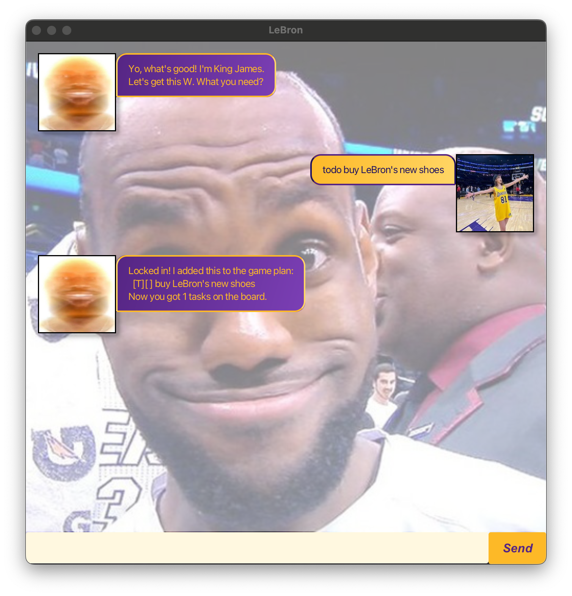
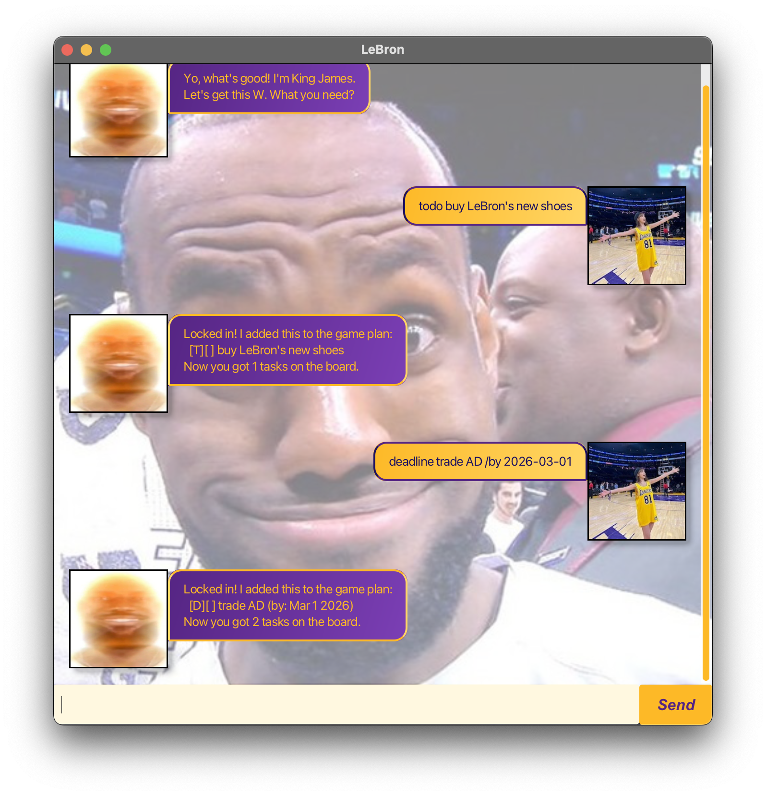
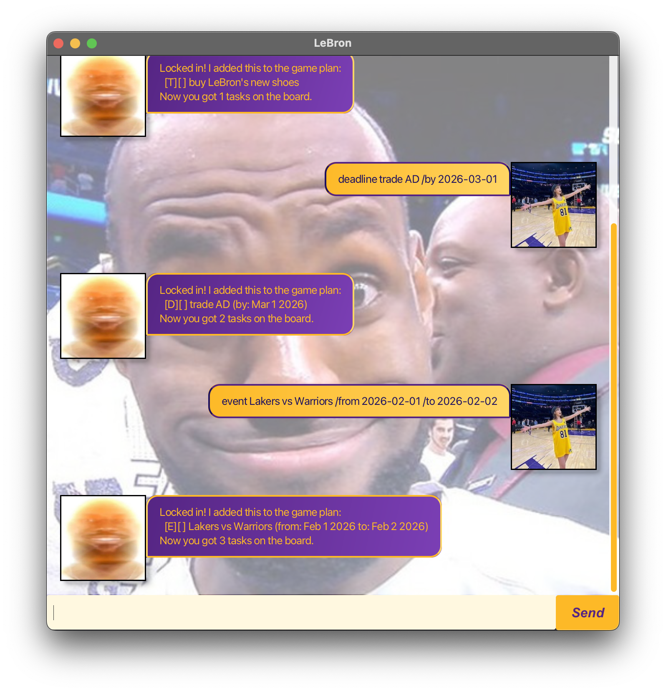
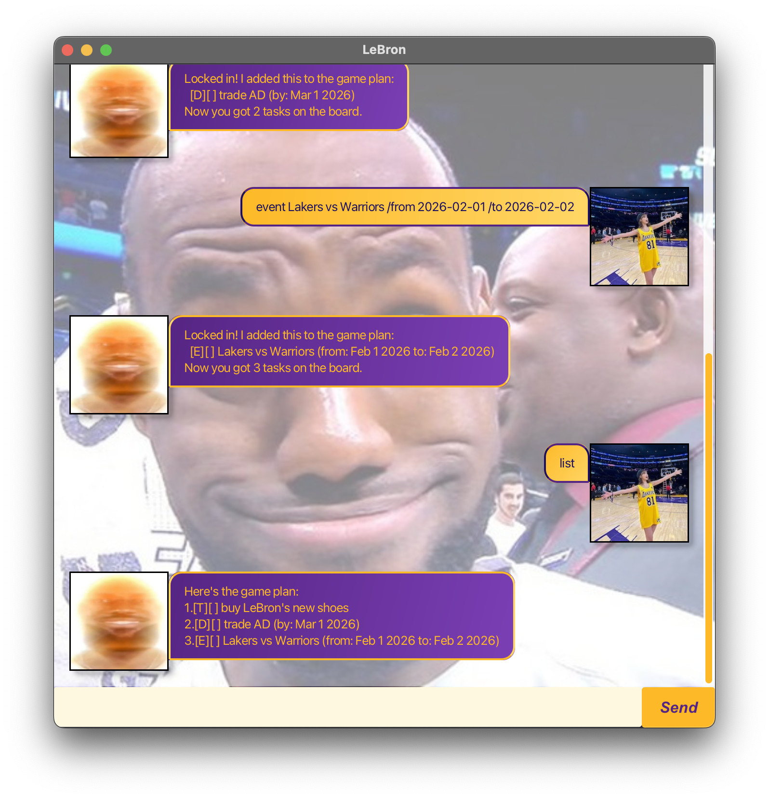
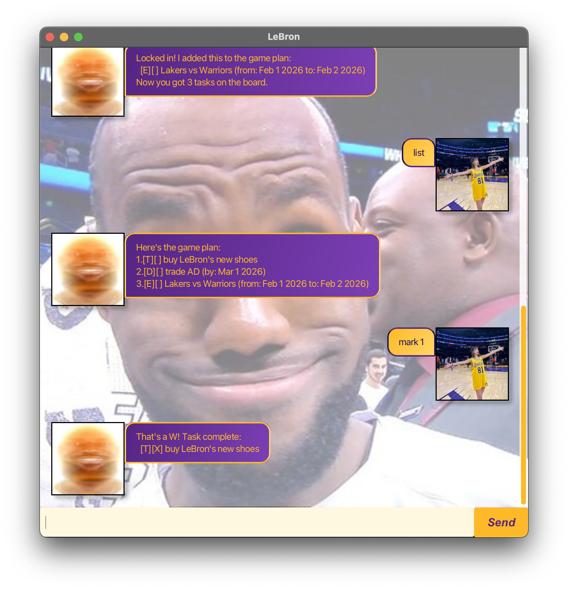
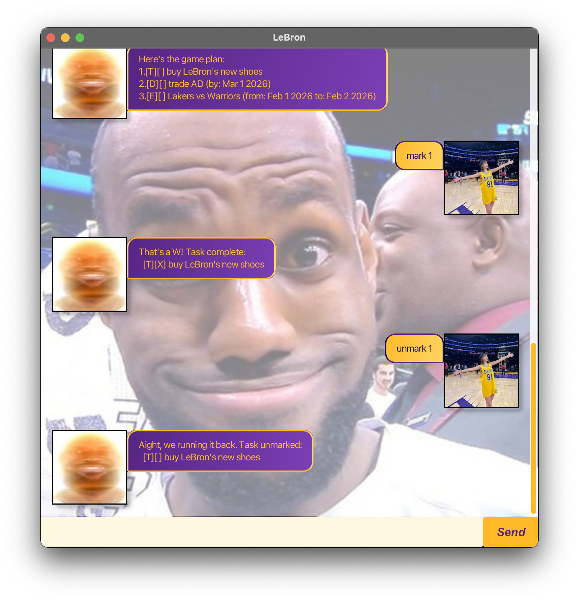
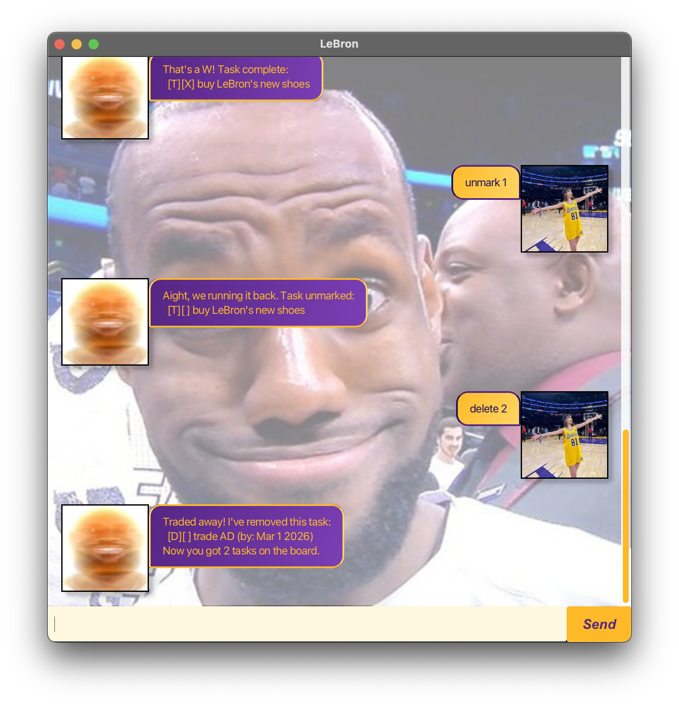
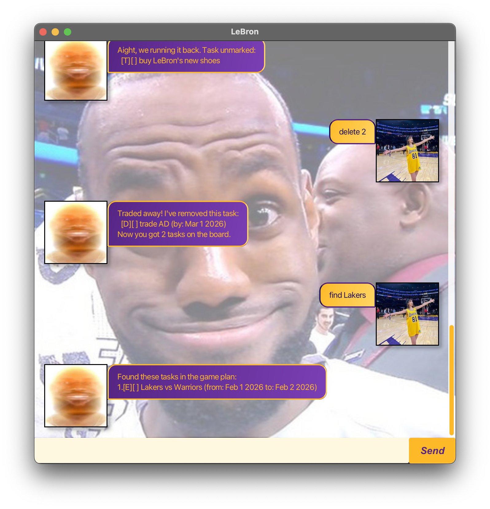
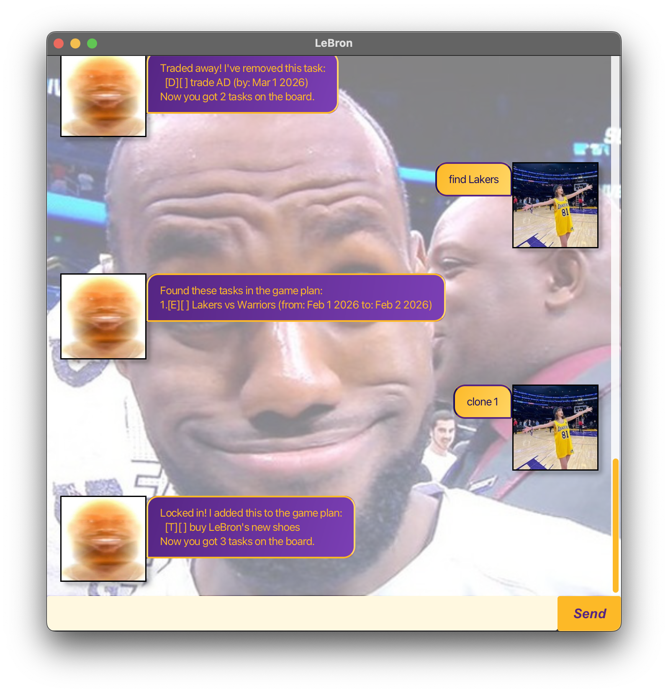
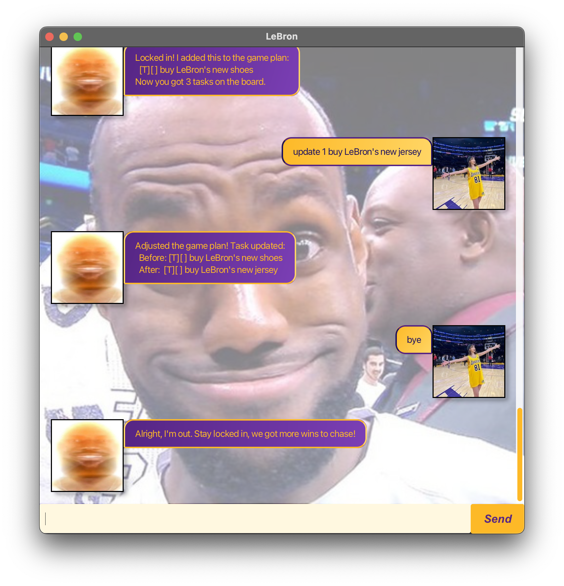

# Lebron User Guide

> *"Yo, what's good! I'm King James. Let's get this W. What you need?"*

Lebron is a **desktop task manager** with the personality of LeBron James. Manage your todos, deadlines, and events — all while getting hyped up by the GOAT himself.


---

## Quick Start

1. Ensure Java 17 or later is installed.
2. Download the latest `lebron.jar` from the releases page.
3. Run it with: `java -jar lebron.jar`
4. Type a command in the input box and hit **Send** or press **Enter**.

---

## Features

### Add a Todo
Adds a simple task with no date attached.

**Format:** `todo DESCRIPTION`

**Example:**
```
todo buy LeBron's new shoes
```

**Expected output:**
```
Locked in! I added this to the game plan:
  [T][ ] buy LeBron's new shoes
Now you got 1 tasks on the board.
```



---

### Add a Deadline
Adds a task that must be done by a specific date.

**Format:** `deadline DESCRIPTION /by DATE`

**Example:**
```
deadline trade AD /by 2026-03-01
```

**Expected output:**
```
Locked in! I added this to the game plan:
  [D][ ] trade AD (by: Mar 1 2026)
Now you got 2 tasks on the board.
```



---

### Add an Event
Adds a task that spans a start and end time.

**Format:** `event DESCRIPTION /from START /to END`

**Example:**
```
event Lakers vs Warriors /from 2026-02-01 /to 2026-02-02
```

**Expected output:**
```
Locked in! I added this to the game plan:
  [E][ ] Lakers vs Warriors (from: Feb 1 2026 to: Feb 2 2026)
Now you got 3 tasks on the board.
```



---

### List All Tasks
Displays all tasks currently on the board.

**Format:** `list`

**Expected output:**
```
Here's the game plan:
1.[T][ ] buy LeBron's new shoes
2.[D][ ] trade AD (by: Mar 1 2025)
3.[E][ ] Lakers vs Warriors (from: Feb 1 2026 to: Feb 2 2026)
```



---

### Mark a Task as Done
Marks a task as completed.

**Format:** `mark INDEX`

**Example:**
```
mark 1
```

**Expected output:**
```
That's a W! Task complete:
  [T][X] buy LeBron's new shoes
```



---

### Unmark a Task
Marks a previously completed task as not done.

**Format:** `unmark INDEX`

**Example:**
```
unmark 1
```

**Expected output:**
```
Aight, we running it back. Task unmarked:
  [T][ ] buy LeBron's new shoes
```



---

### Delete a Task
Removes a task from the list entirely.

**Format:** `delete INDEX`

**Example:**
```
delete 2
```

**Expected output:**
```
Traded away! I've removed this task:
  [D][ ] trade AD (by: Mar 1 2025)
Now you got 2 tasks on the board.
```



---

### Find Tasks
Searches for tasks containing a keyword.

**Format:** `find KEYWORD`

**Example:**
```
find Lakers
```

**Expected output:**
```
Found these tasks in the game plan:
1.[E][ ] Lakers vs Warriors (from: 7pm to: 10pm)
```



---

### Clone a Task
Duplicates an existing task and appends it to the list.

**Format:** `clone INDEX`

**Example:**
```
clone 1
```

**Expected output:**
```
Locked in! I added this to the game plan:
  [T][ ] buy LeBron's new shoes
Now you got 3 tasks on the board.
```



---

### Update a Task
Edits the fields of an existing task. Only the fields you provide are changed — everything else is kept from the original. The task type cannot be changed.

**Format:**
- Todo: `update INDEX NEW_DESCRIPTION`
- Deadline: `update INDEX [NEW_DESCRIPTION] /by NEW_DATE`
- Event: `update INDEX [NEW_DESCRIPTION] /from NEW_START /to NEW_END`

**Example:**
```
update 1 buy LeBron's new jersey
```

**Expected output:**
```
Adjusted the game plan! Task updated:
  Before: [T][ ] buy LeBron's new shoes
  After:  [T][ ] buy LeBron's new jersey
```


---

### Exit
Closes the application after a short delay.

**Format:** `bye`

**Expected output:**
```
Alright, I'm out. Stay locked in, we got more wins to chase!
```



---

## Data Storage

Tasks are automatically saved to `./data/lebron.txt` after every command. They are loaded back when the app starts. If the file is missing, the app starts with an empty task list and creates a fresh file on the next save.

---

## Command Summary

| Command | Format |
|---|---|
| Add todo | `todo DESCRIPTION` |
| Add deadline | `deadline DESCRIPTION /by DATE` |
| Add event | `event DESCRIPTION /from START /to END` |
| List | `list` |
| Mark done | `mark INDEX` |
| Unmark | `unmark INDEX` |
| Delete | `delete INDEX` |
| Find | `find KEYWORD` |
| Clone | `clone INDEX` |
| Update | `update INDEX [fields...]` |
| Exit | `bye` |
